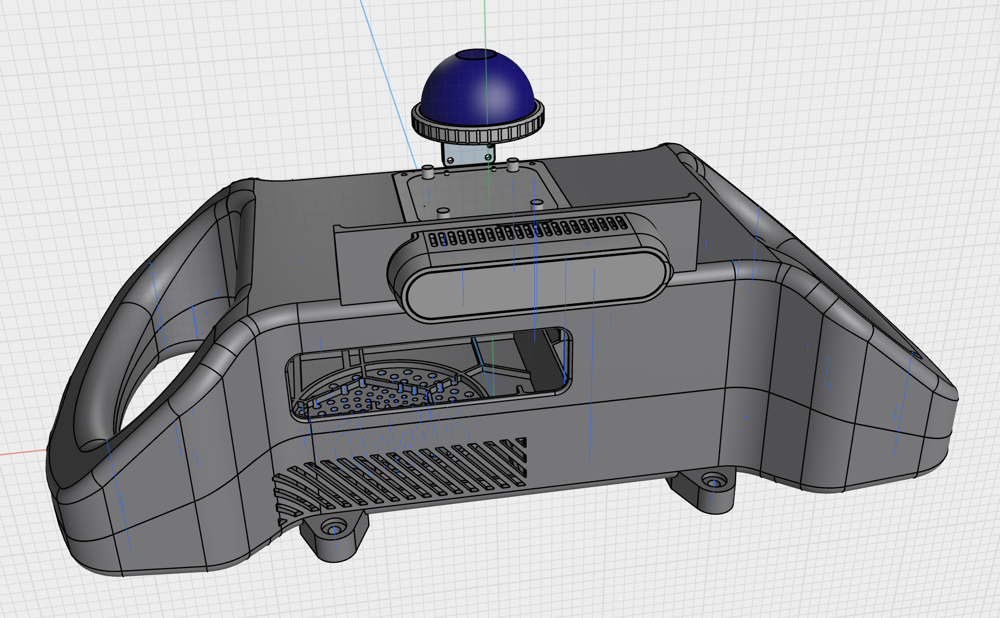
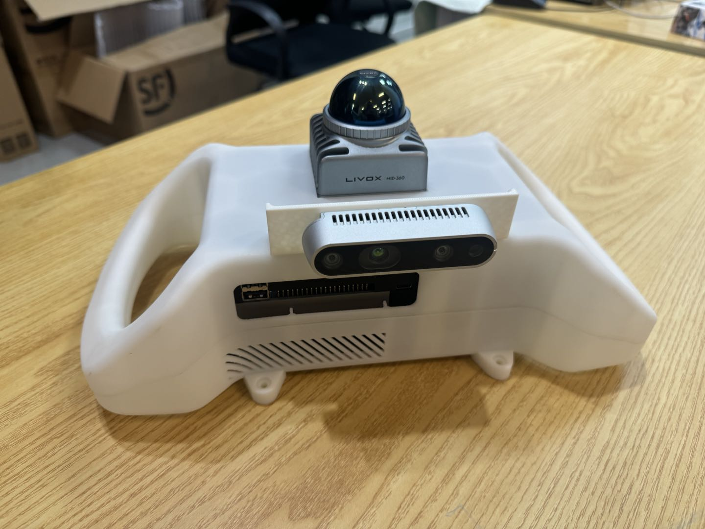

# JLV-handhold: Jetson Lidar and Vision for Robotics and Embodied

|Stp View|Real View|
|--|--|
|||

This repository introduces a handheld device that integrates an Nvidia Jetson, a Livox Mid360, and a Realsense camera into a single piece of hardware. It can be quickly and easily assembled using 3D printing. It features a built-in battery compartment and visual sensor ports, allowing for quick adaptation to different vision sensor models by replacing the middleware. Four threaded mounting holes are added to the bottom of the device, allowing it to be mounted on a mobile vehicle, creating an all-in-one solution leveraging the computing power of the Jetson. We also provide manuals for compiling several common projects on the Arm architecture, including SLAM, calibration, GPU acceleration, and PyTorch compilation.

这个仓库介绍了一款手持设备，将 Nvidia Jetson、Livox Mid360以及Realsense相机集成到一个硬件上，你可以通过3D打印的方式，方便快捷地进行组装。内置一个电池仓，以及视觉传感器孔位，通过替换中间件即可快速适配不同型号的视觉传感器。在设备底部添加了四个固定螺纹孔，你可以将其安装到移动小车上，配合 Jetson 算力实现一体式解决方案。我们同时还提供了多个常用工程在 Arm 架构上编译的手册，包括 SLAM、标定、GPU加速、pytorch 编译等。

We provide the following language versions of the ReadMe file to help you quickly familiarize yourself with this project. Click the hyperlink below to jump:

我们提供了以下语言版本的 ReadMe 文件以帮助你快速熟悉这个工程，点击下方超链接进行跳转：

* [README-CN.md](./resources/ReadMe-CN.md)：简体中文；
* [README-EN.md](./resources/ReadMe-EN.md)：English-US；

----

# Contributors

The hardware and testing facilities for this project were provided by the `Institute of Automation, Chinese Academy of Sciences`. The following individuals made significant contributions to the development of this project, and we would like to thank them for their efforts:

该工程由 `中国科学院自动化研究所` 提供硬件与测试场地，同时以下人员在该项目的开发中做出了巨大贡献，在此感谢他们的付出：

[WenJiang Xu 徐文江](https://github.com/HEA1OR)，[PengFei Yi 易鹏飞](https://github.com/alfie010)，[JingKai Xu 徐靖凯](https://github.com/Triumphant-strain)，[XingYu Wang 王行宇](https://github.com/xywang227)，[YaNan Hao 郝亚楠](https://github.com/haoyanan2024)，[YuWei Wang 王雨薇](https://github.com/YuweiWang2002)

----

# News

* 2025-08-22: Init the repo