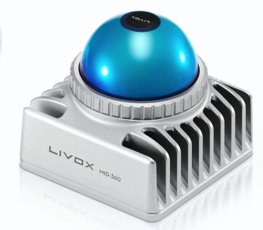
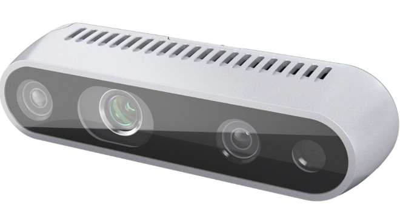
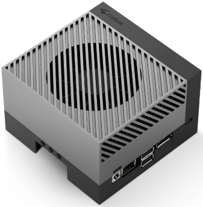
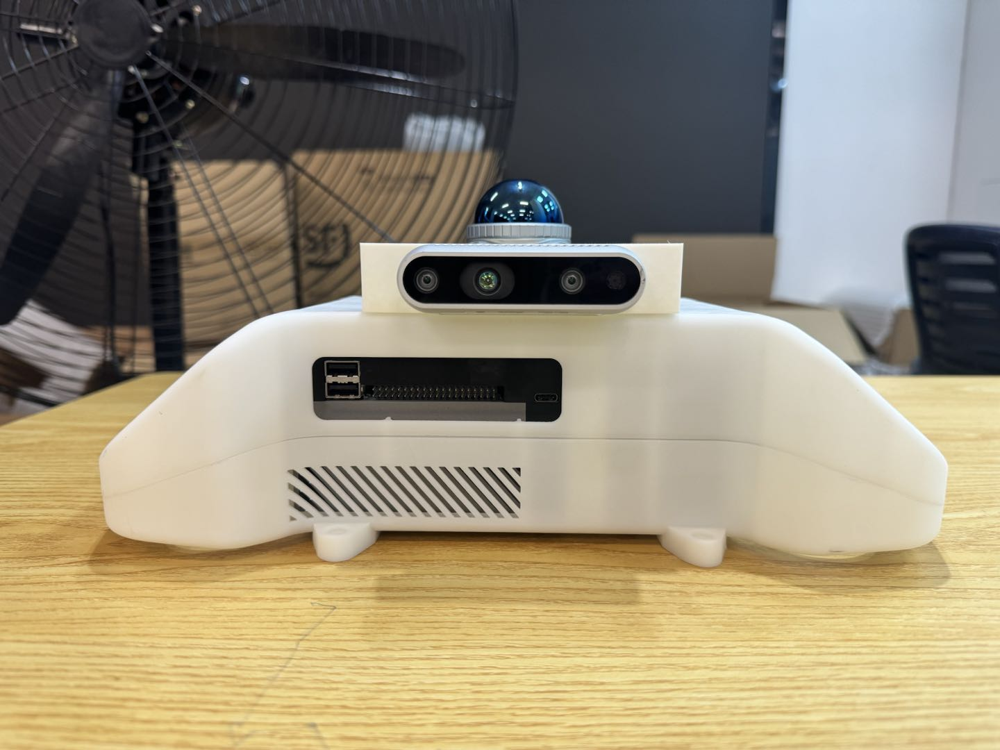
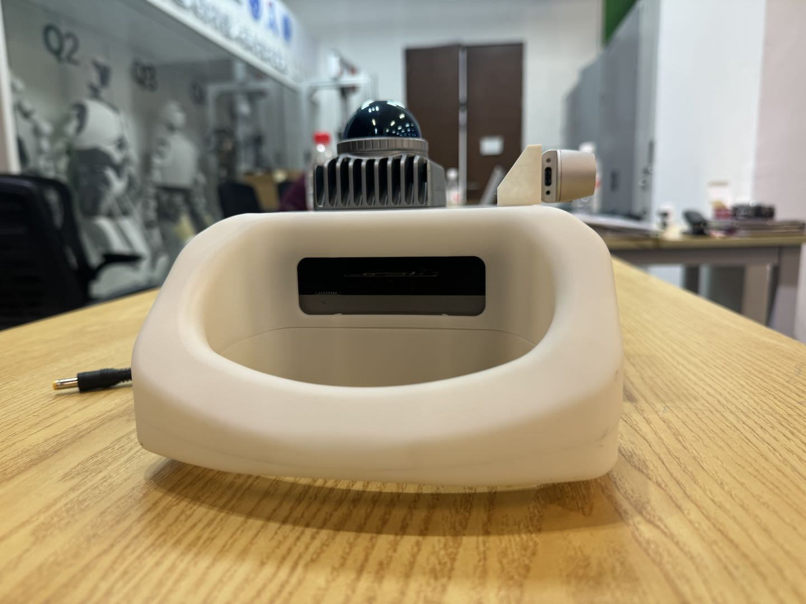
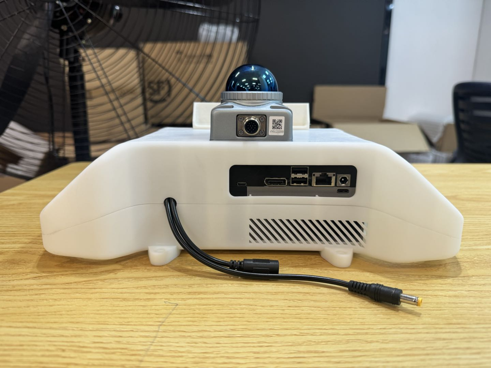
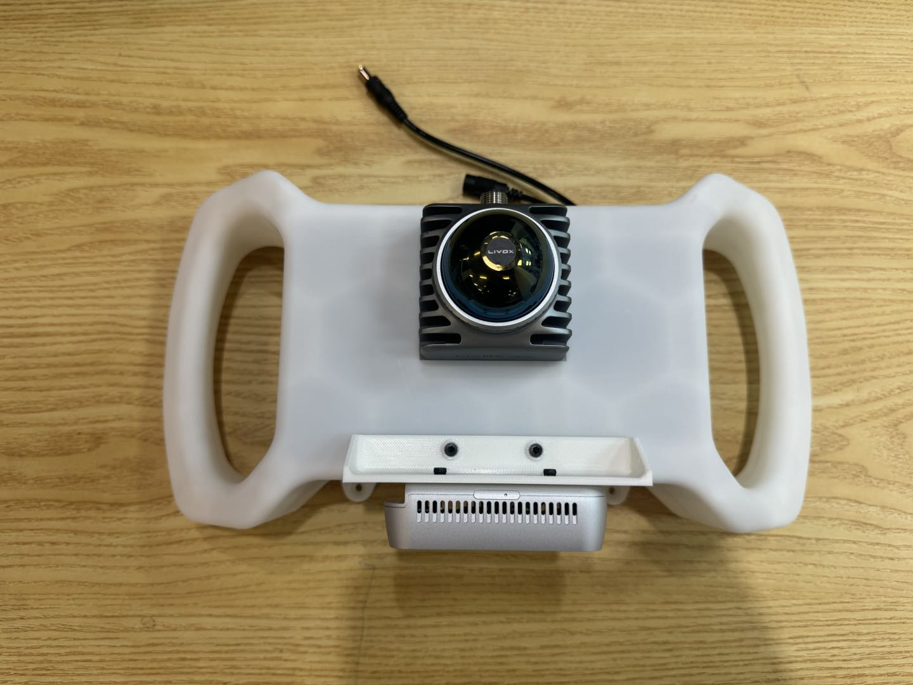
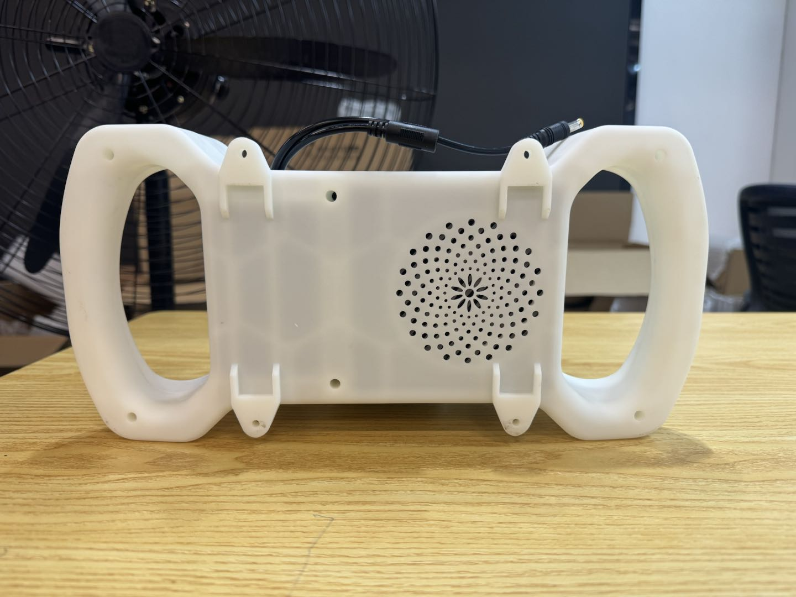

# JLV-handhold: Jetson Lidar and Vision for Robotics and Embodied

## 目录

* [设备亮点](#设备亮点)
* [物料清单](#物料清单)
* [组装](#组装)
* [编译与应用](#编译与应用)

---
## 设备亮点

我们很荣幸推出一款手持设备，它将 Nvidia Jetson、Livox Mid360、RealSense 相机硬件合理地组装在一起，并提供了符合人体工程学设计的把手。该设备的有一下几个特点：

1. **模块化组装**：每部个结构均可通过3D打印获得，并用螺丝进行加固，你可以随时替换算力板、雷达、视觉相机组件，只需一个中间结构件；
2. **紧凑的结构设计**：在保证高空间利用率的同时，提供了多处散热槽以确保设备正常工作，你也可以通过模块化组件添加额外的散热风扇；
3. **为 Jetson 量身定制**：算力仓根据 Orin DK 尺寸设计，兼容除 Thor 以外的所有 Jetson 计算板，同样只需要一个中间结构件；
4. **内置电池仓**：内置的电池仓可以让你随时随地开机即用，无需携带额外电源；
5. **手持握把**：在设备两侧提供了人体工程学设计的握持把手，均匀将力分配到两臂，一次性使用 1 小时也不会感到疲惫；
6. **预留螺纹孔**：手持扫描结束后可以通过预留的四个螺纹孔将其安装到其他硬件平台上，无需其他算力；

另一方面，由于在 Arm 上编译一些优秀的开源工程极具挑战性，我们也为部分项目撰写了编译手册，以便让你能够在这里找到一站式解决方案，当前支持的开源项目有：

【注意】：**有关编译手册的内容详情请见后续的 `编译` 章节，下面的链接为原始项目链接。**

* FAST-LIO: [https://github.com/hku-mars/FAST_LIO#](https://github.com/hku-mars/FAST_LIO#)
* FAST-LIVO2: [https://github.com/hku-mars/FAST-LIVO2](https://github.com/hku-mars/FAST-LIVO2)
* Point-LIO: [https://github.com/hku-mars/Point-LIO#](https://github.com/hku-mars/Point-LIO#)
* livox_camera_calib: [https://github.com/hku-mars/livox_camera_calib](https://github.com/hku-mars/livox_camera_calib)
* Yolov11 with GPU: [https://github.com/ultralytics/ultralytics](https://github.com/ultralytics/ultralytics)

更多开源项目的编译我们会持续推出，敬请期待！

----

## 物料清单

我们的示例设备包含了以下硬件，但你仍然可以进行自由搭配，只需算力仓和电池仓尺寸兼容即可。

|类别|设备|官方指导价|图片|
|--|--|--|--|
|LiDAR|[Livox Mid360](https://www.livoxtech.com/cn/mid-360)|¥3,999.00||
|RGBD Camera|[RealSense D435i](https://store.realsenseai.com/buy-intel-realsense-depth-camera-d435i.html)|$ 354.00||
|Computer|[Nvidia Jetson Orin DK](https://www.nvidia.cn/autonomous-machines/embedded-systems/jetson-orin/)|¥ 15,999||
|Battery|Custom Made|¥ 250|None|

* 注意：`官方指导价` 使用了不同汇率标识以避免汇率歧义；

对于 Jetson Orin 和 Mid360 的组合而言，我们使用了 `15600 mAH`，功率 `187 W`，标称电压 `12.0 V` 的定制锂电池，你可以找到 [定制商户](http://191624.51sole.com/) 并向其提供型号为 `TSY 18650-187W` 信息以直接购买。 
 
----

## 组装

下载文件 [0000-shouchijiance_asm.stp](./model/0000-shouchijiance_asm.stp) 并用 3D 打印机进行打印。由于模块化设计，你仅需要注意的是计算单元仓和电池仓的尺寸，同时如果你的电池输入输出孔位与我们模型不符，建议稍微修改电池仓开孔位置。

* 计算单元仓尺寸：110mm x 110mm x 71mm
* 电池仓尺寸：93mm x 70mm x 69mm

如果你想要让 Mid360 雷达倾斜安装，那么也可以通过增加中间件的方式实现，为激光雷达添加一个斜坡。

最终我们的组装效果如下所示：

|Front|Left|Back|Top|Button|
|--|--|--|--|--|
||||||

----

## 编译与应用

我们对广受好评的一些工程提供了在 Jetson 平台上编译的手册，包括了以下内容：

* Fast-LIO: [https://github.com/GaohaoZhou-ops/JetsonSLAM/tree/main/fast_lio_project](https://github.com/GaohaoZhou-ops/JetsonSLAM/tree/main/fast_lio_project)
* Fast-LIVO2: [https://github.com/GaohaoZhou-ops/JetsonSLAM/tree/main/fast_livo2_project](https://github.com/GaohaoZhou-ops/JetsonSLAM/tree/main/fast_livo2_project)
* Point-LIO: [https://github.com/GaohaoZhou-ops/JetsonSLAM/tree/main/point_lio_project](https://github.com/GaohaoZhou-ops/JetsonSLAM/tree/main/point_lio_project)
* livox_camera_calib: [https://github.com/GaohaoZhou-ops/Lidar-Camera-Calibration](https://github.com/GaohaoZhou-ops/Lidar-Camera-Calibration)
* Yolov11: [https://github.com/GaohaoZhou-ops/JetsonYoloROS](https://github.com/GaohaoZhou-ops/JetsonYoloROS)

除此之外，还有一些我们自己使用的 Demo 示例可用于参考：

* Tello-LLM-ROS: [https://github.com/GaohaoZhou-ops/Tello-LLM-ROS](https://github.com/GaohaoZhou-ops/Tello-LLM-ROS)
* Mixed-Navigation: [https://github.com/GaohaoZhou-ops/Mixed-Navigation](https://github.com/GaohaoZhou-ops/Mixed-Navigation)

我们后续会补充更多工程在 Jetson 平台上的编译手册。

