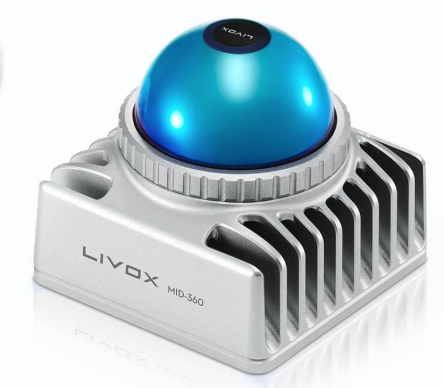
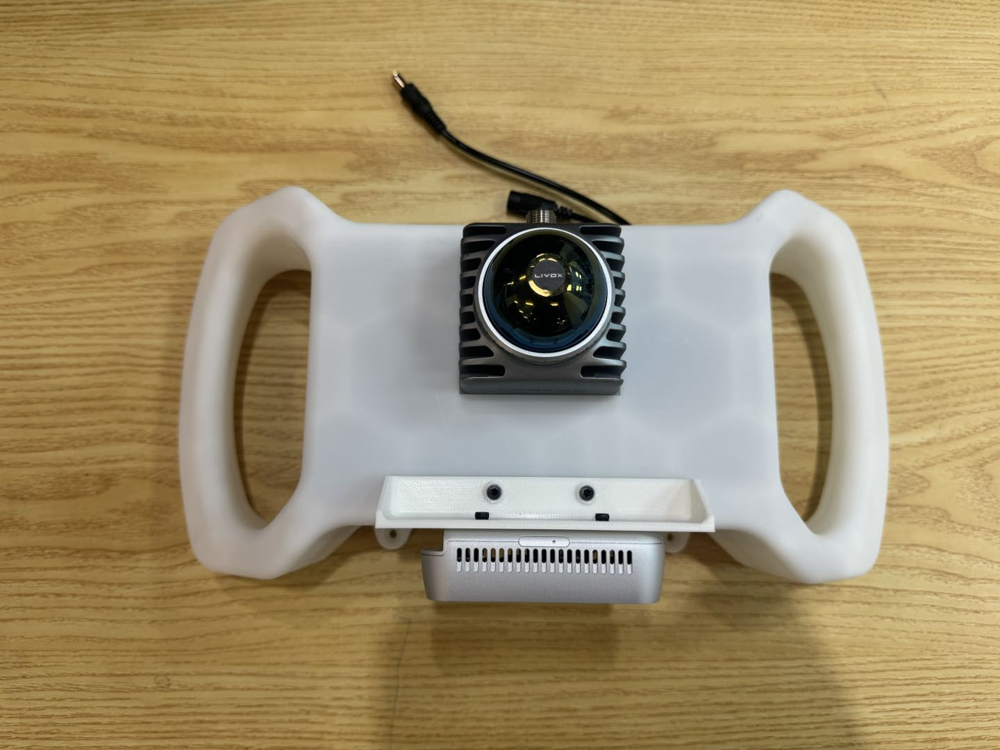

# JLV-handhold: Jetson Lidar and Vision for Robotics and Embodied

## Table of Contents

* [Device Highlights](#device-highlights)
* [Bill of Materials (BOM)](#bill-of-materials)
* [Assembly](#assembly)
* [Compling and Applying](#compiling-and-applying)

---
## Device Highlights

We are proud to introduce a handheld device that seamlessly integrates Nvidia Jetson, Livox Mid360, and RealSense camera hardware with an ergonomically designed handle. The device has the following features:

1. **Modular Assembly**: Each component is 3D-printed and reinforced with screws. You can replace the hashboard, radar, and vision camera components at any time, requiring only a single intermediate component.
2. **Compact Design**: While ensuring high space utilization, it provides multiple heat sinks to ensure proper operation. Additional cooling fans can also be added through modular components.
3. **Customized for Jetson**: The hashboard is designed based on the Orin DK form factor and is compatible with all Jetson computing boards except the Thor, also requiring only a single intermediate component.
4. **Built-in Battery Compartment**: The built-in battery compartment allows for instant operation anytime, anywhere, without the need for carrying an external power supply.
5. **Handheld Grip**: Ergonomically designed grips on both sides of the device evenly distribute force, ensuring fatigue-free use for an hour.
6. **Pre-installed Threaded Holes**: After handheld scanning, the device can be mounted to other hardware platforms using four pre-installed threaded holes, eliminating the need for additional computing power.

On the other hand, due to the availability of Arm Compiling some excellent open source projects is extremely challenging. We've also written compilation manuals for some projects to provide a one-stop solution. Currently supported open source projects include:

[Note]: For more information about the compilation manuals, please see the "Compiling" section below. The links below are to the original project links. **

* FAST-LIO: [https://github.com/hku-mars/FAST_LIO#](https://github.com/hku-mars/FAST_LIO#)
* FAST-LIVO2: [https://github.com/hku-mars/FAST-LIVO2](https://github.com/hku-mars/FAST-LIVO2)
* Point-LIO: [https://github.com/hku-mars/Point-LIO#](https://github.com/hku-mars/Point-LIO#)
*livox_camera_calib: [https://github.com/hku-mars/livox_camera_calib](https://github.com/hku-mars/livox_camera_calib)
* Yolov11 with GPU: [https://github.com/ultralytics/ultralytics](https://github.com/ultralytics/ultralytics)

We will continue to release compilations of more open source projects, so stay tuned!

----

## Bill of Materials

Our sample device includes the following hardware, but you can customize your setup as needed, as long as the computing and battery compartments are compatible.

|Category|Device|Official Suggested Price|Image|
|--|--|--|--|
|LiDAR|[Livox Mid360](https://www.livoxtech.com/cn/mid-360)|¥3,999.00||
|RGBD Camera|[RealSense D435i](https://store.realsenseai.com/buy-intel-realsense-depth-camera-d435i.html)|$354.00||
|Computer|[Nvidia Jetson Orin DK](https://www.nvidia.cn/autonomous-machines/embedded-systems/jetson-orin/)|¥ 15,999||
|Battery|Custom Made|¥ 250| 93mm x 70mm x 69mm |

* Note: `Official Guidance Price` uses different exchange rate identifiers to avoid exchange rate ambiguity;

For the Jetson Orin and Mid360 combination, we used a custom lithium-ion battery with a capacity of `15600 mA`, a power of `187 W`, and a nominal voltage of `12.0 V`. You can purchase this directly from a custom [merchant](http://191624.51sole.com/) and provide the code `TSY 18650-187W`.

----

## Assembly

Download the file [0000-shouchijiance_asm.stp](./model/0000-shouchijiance_asm.stp) and print it on a 3D printer. Due to the modular design, you only need to pay attention to the dimensions of the computer unit compartment and the battery compartment. If your battery input and output holes do not match our model, we recommend slightly modifying the battery compartment opening position.

* Computer unit compartment dimensions: 110mm x 110mm x 71mm
* Battery compartment dimensions: 93mm x 70mm x 69mm

If you want to install the Mid360 radar at an angle, you can also add middleware to add a slope to the lidar.

The final assembly is as follows:

|Front|Left|Back|Top|Button|
|--|--|--|--|--|
||||||

----

## Compiling and Applying

We have compiled some of our popular projects on the Jetson platform, including the following:

* Fast-LIO: [https://github.com/GaohaoZhou-ops/JetsonSLAM/tree/main/fast_lio_project](https://github.com/GaohaoZhou-ops/JetsonSLAM/tree/main/fast_lio_project)
* Fast-LIVO2: [https://github.com/GaohaoZhou-ops/JetsonSLAM/tree/main/fast_livo2_project](https://github.com/GaohaoZhou-ops/JetsonSLAM/tree/main/fast_livo2_project)
* Point-LIO: [https://github.com/GaohaoZhou-ops/JetsonSLAM/tree/main/point_lio_project](https://github.com/GaohaoZhou-ops/JetsonSLAM/tree/main/point_lio_project)
*livox_camera_calib: [https://github.com/GaohaoZhou-ops/Lidar-Camera-Calibration](https://github.com/GaohaoZhou-ops/Lidar-Camera-Calibration)
* Yolov11: [https://github.com/GaohaoZhou-ops/JetsonYoloROS](https://github.com/GaohaoZhou-ops/JetsonYoloROS)

In addition, there are some demo examples we use for reference:

* Tello-LLM-ROS: [https://github.com/GaohaoZhou-ops/Tello-LLM-ROS](https://github.com/GaohaoZhou-ops/Tello-LLM-ROS)
* Mixed-Navigation: [https://github.com/GaohaoZhou-ops/Mixed-Navigation](https://github.com/GaohaoZhou-ops/Mixed-Navigation)

We will add more compilation guides for projects on the Jetson platform in the future.